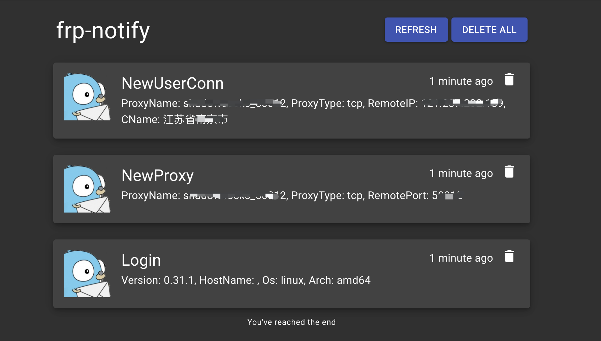

## frp-notify

[](https://github.com/arugal/frp-notify/actions?query=branch%3Amaster+event%3Apush+workflow%3ABuild)

一个专注于消息通知的 [frp server manager plugin](https://github.com/fatedier/frp/blob/master/doc/server_plugin_zh.md) 实现，让你对进入 `frps` 的连接了如指掌，不再裸奔。

## 快速启动

[下载地址](https://github.com/arugal/frp-notify/releases)

### 目录介绍

```bash
* frp-notify
└─── system
|    |          frp-notify.service                  # linux 系统服务配置文件
|
│           frp-notify                              # frp-notify 程序
|           frp-notify.json                      # 通知插件配置文件
```

### 打印帮助信息

```bash
./frp-notify --help
```

### 命令行启动

```bash
./frp-notify start -c /etc/frp-notify/frp-notify.json -b 127.0.0.1:50080
```

## 配置介绍

### frps

在 `frps.ini` 增加以下配置

```
[plugin.frp-notify]
addr = 127.0.0.1:50080                             // frp-notify 地址
path = /handler                                    // frp-notify url, 固定配置
ops = Login,NewProxy,NewWorkConn,NewUserConn       // 通知的操作
```

### 黑白名单配置（`IP` 过滤）

先判断白名单，后判断黑名单。仅对 `NewUserConn` 有效。

```
{
  "blacklist": [                                   // 黑名单
    "127.0.0.1"
  ],
  "whitelist": [                                   // 白名单
    "127.0.0.1"
  ],
  "notify_plugins": [
    ...
  ]
}
```

### 通知插件配置

在 `frp-notify.json` 文件中按需配置通知插件，支持同时配置多个插件。

#### log

将消息打印到控制台，用于调试。

```
{
  "notify_plugins": [
    {
      "name": "log",                                                               // 固定配置
      "config": {}
    }
  ]
}
```

#### dingTalk

将消息发送到钉钉。

```
{
  "notify_plugins": [
    {
      "name": "dingTalk",                                                               // 固定配置
      "config": {
        "token": "df54651465c1189b76fd13f910b76bed361f8fff31bf9118b1896bc148500000",    // dingTalk 自定义机器人 token
        "secret": "SEC97d8a209f9ddda25b89d63d82a0b2ad4065504cbe4bc043719fbb1a0000000",  // dingTalk 自定义机器人 secret
        "is_at_all": true                                                               // 发送消息时是否@所有人
      }
    }
  ]
}
```


#### gotify

将消息发送到 [gotify-server](https://github.com/gotify/server)。

```
{
  "notify_plugins": [
    {
      "name": "gotify",                                                                // 固定配置
      "config": {
        "server_addr": "127.0.0.1:40080",                                              // gotify-server 服务地址
        "app_token": "token"                                                           // gotify-server 配置的 app token
      }
    }
  ]
}
```
